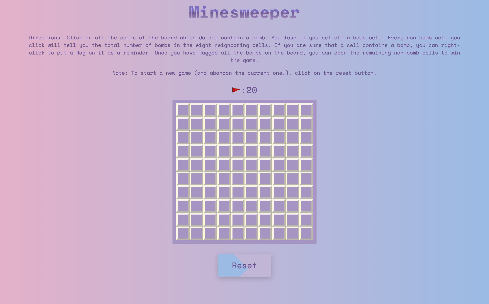

# Minesweeper

## Table of Contents
*  [Description](#description)
*  [User Story](#user-story)
*  [Features of the Application](#features-of-the-application)
*  [Preview of Minesweeper](#preview-of-minesweeper)
*  [Links](#links)
*  [Built Using](built-using)
*  [License](#license)
*  [Contributing](#contributing)
*  [Questions](#questions)

## Description

Originally created in the 1960s, Minesweeper is a single-player puzzle video game. The objective of the game is to clear the board/grid containing hidden bombs (or "mines") without detonating any of them, with help from clues about the number of neighboring mines in each square.

The numbers on the board represent how many bombs are adjacent to a square. For example, if a square has a "3" on it, then there are 3 bombs next to that square. The bombs could be above, below, right, left, or diagonal to the square.

The user can either right-click or hold down the shift key and click a square to place a flag where they think a bomb is. This allows the user to avoid that spot.

Avoid and flag all the bombs and expose all the empty spaces to win Minesweeper.

Minesweeper features dynamically updated HTML and CSS powered by Javascript, with the use of recursion to check the neighboring squares for bombs. It also features a clean and polished user interface that is responsive, ensuring that it adapts to multiple screen sizes.

## User Story
~~~
AS A user  
I WANT to play a minesweeper game  
SO THAT I can have fun while using my deduction skills.  
~~~

## Features of the Application
~~~
GIVEN I am playing a minesweeper game  
WHEN I click on a square  
THEN I am presented with a bomb or a non-bomb.  

WHEN I click on a non-bomb square  
THEN I am presented with the total number of bombs in the eight neighboring squares.  

WHEN I click on a bomb square  
THEN the game is over and I lose.  

WHEN I right-click on a square  
THEN the square will then have a flag.  

WHEN I have flagged all the bombs on the board  
THEN I can open the remaining non-bomb squares to win the game.  

WHEN I have flagged all twenty of the bombs and have opened the remaining non-bomb squares  
THEN I will have won the game.  

WHEN I click on the reset button  
THEN I start a new game and abandon the current one.  
~~~

## Preview of Minesweeper

The following animation demonstrates the application functionality:

## Links
- [Deployed Application]()
- [Github Repository](https://github.com/rh9891/Minesweeper)

## Built Using

Listed below are the guides that made building this game possible:

* [Javascript](https://developer.mozilla.org/en-US/docs/Web/JavaScript/Guide)
* [Minesweeper Tutorial](https://www.youtube.com/watch?v=rxdGAKRndz8)
* [Recursion](https://developer.mozilla.org/en-US/docs/Glossary/Recursion)

## License

This application does not currently have any licenses.

The user is not permitted to use, modify, or share any parts of it. Though the code for this application is hosted on Github, where you are allowed to view and fork the code, this does not imply that the user is permitted to use, modify, or share the contents of this application for any purpose.

## Contributing

If you would like to contribute to this repository, please contact me via [Github](https://github.com/rh9891).

## Questions

If you have any questions, comments, or issues regarding this application, please do not hesitate to contact me via [Github](https://github.com/rh9891).